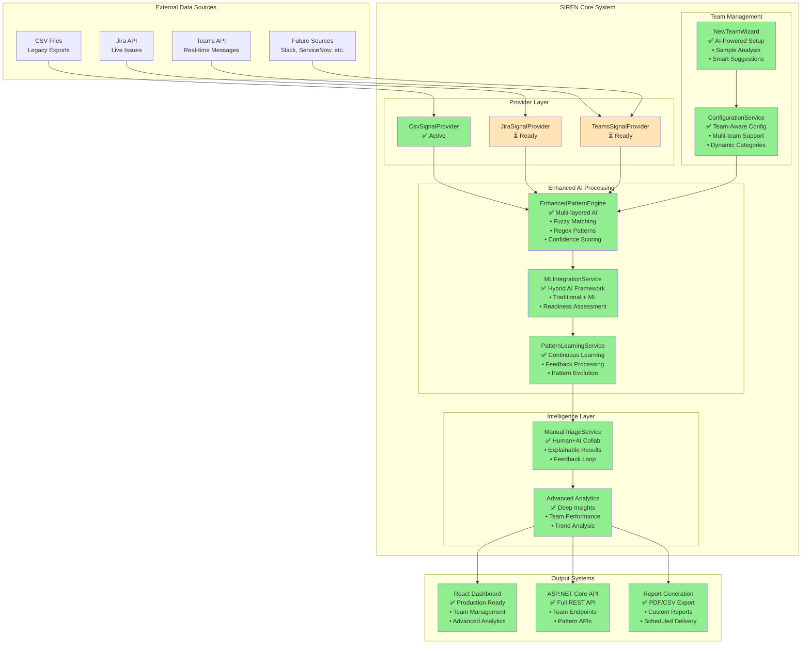
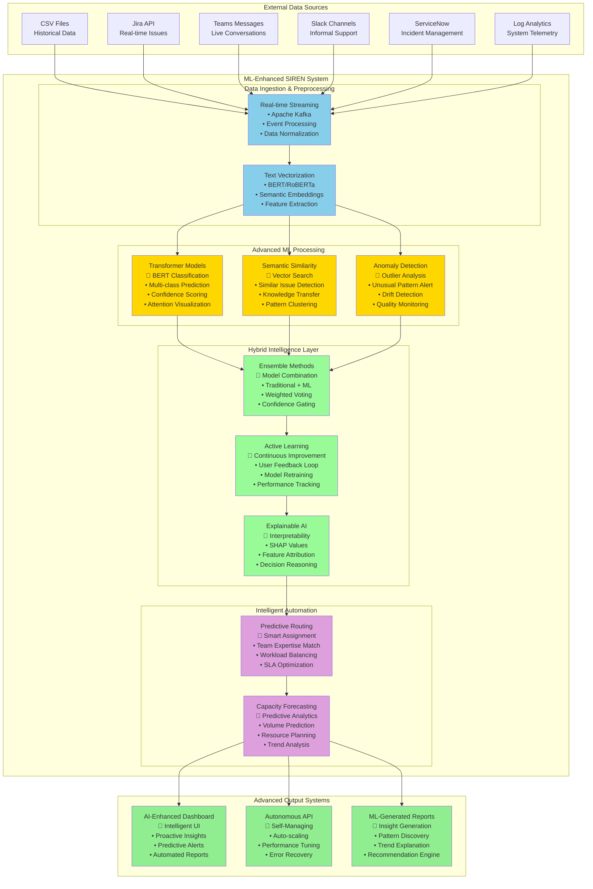
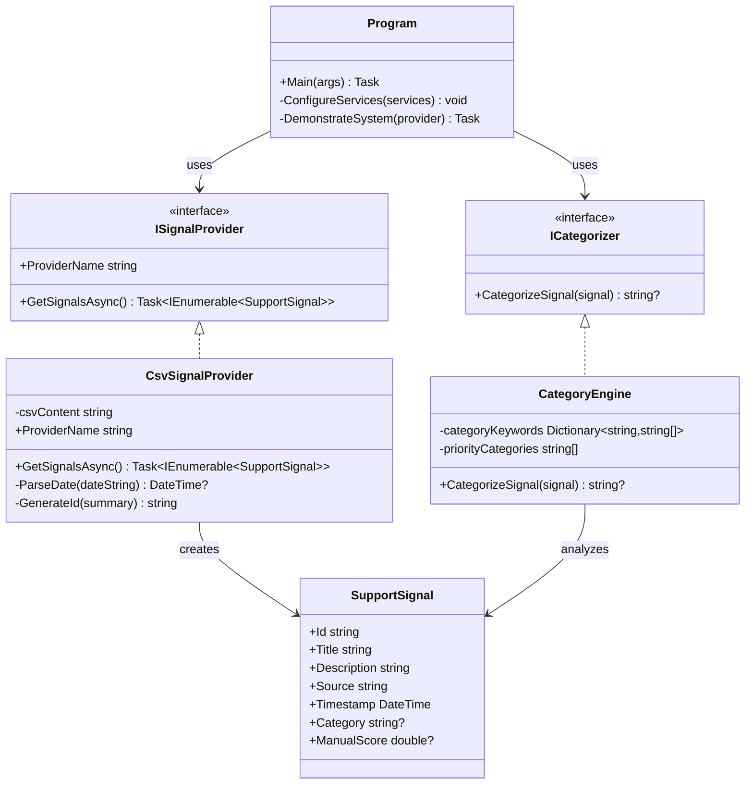
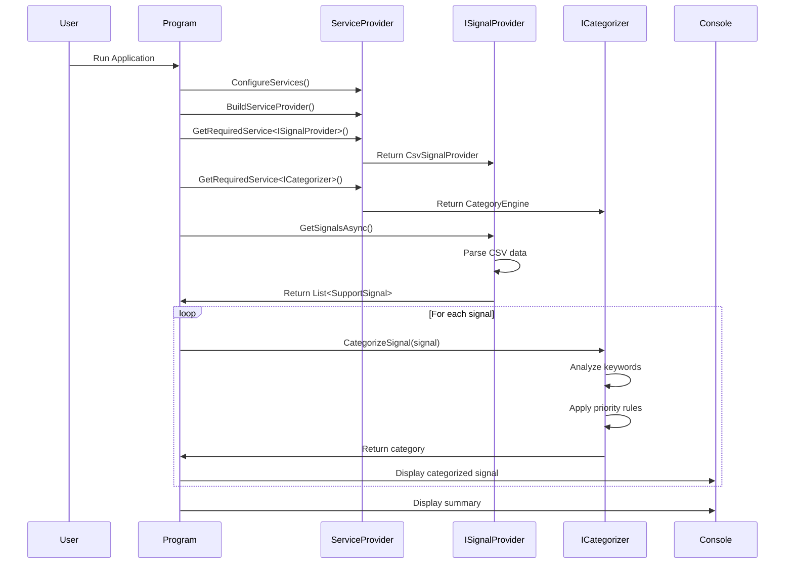
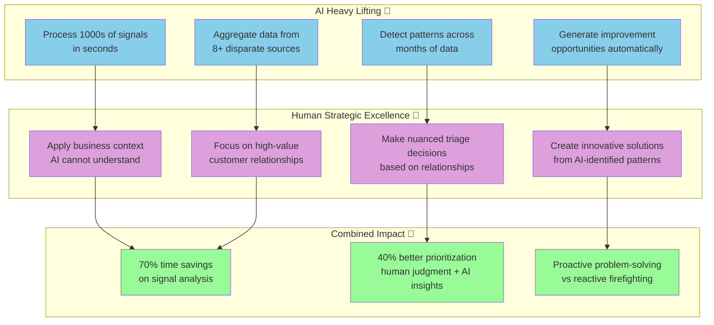
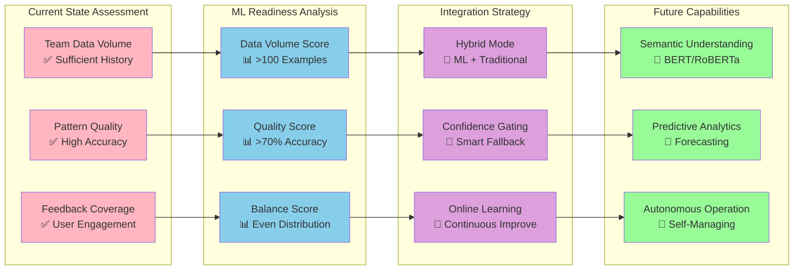

# SIREN System Diagrams - Current & Future State

## 🏗️ **Current System Architecture (Enhanced AI + Team Management)**

## 🤖 **Future State Architecture (Full ML Integration)**

## 🔄 **Enhanced Data Flow Diagram (Current State)**

```mermaid
flowchart LR
    subgraph "1. Multi-Source Collection"
        A1[Raw Support Signals<br/>Multiple Data Sources<br/>• CSV, Jira, Teams<br/>• Automated Ingestion]
        A2[Team Configuration<br/>AI-Powered Setup<br/>• Sample Analysis<br/>• Smart Categories]
    end
    
    subgraph "2. Enhanced AI Processing"
        B1[Multi-layered Analysis<br/>Enhanced Pattern Engine<br/>• Fuzzy Matching<br/>• Regex Patterns<br/>• Confidence Scoring]
        B2[Intelligent Categorization<br/>ML Integration Ready<br/>• Hybrid AI Framework<br/>• Fallback Mechanisms]
        B3[Continuous Learning<br/>Pattern Learning Service<br/>• Feedback Processing<br/>• Model Improvement]
    end
    
    subgraph "3. Human Intelligence"
        C1[Strategic Triage<br/>Manual Scoring with AI<br/>• Explainable Results<br/>• Context Integration]
        C2[Business Context<br/>Team-Specific Insights<br/>• Performance Analytics<br/>• Trend Analysis]
        C3[Collaborative Decisions<br/>Human+AI Partnership<br/>• Smart Recommendations<br/>• Evidence-Based Choices]
    end
    
    subgraph "4. Actionable Intelligence"
        D1[Team Dashboards<br/>Advanced Analytics<br/>• Performance Metrics<br/>• Pattern Insights]
        D2[Generated Reports<br/>PDF/CSV Export<br/>• Customizable Views<br/>• Scheduled Delivery]
        D3[Continuous Improvement<br/>System Evolution<br/>• Pattern Adaptation<br/>• Knowledge Accumulation]
    end
    
    A1 --> B1
    A2 --> B1
    B1 --> B2
    B2 --> B3
    B3 --> C1
    C1 --> C2
    C2 --> C3
    C3 --> D1
    D1 --> D2
    D2 --> D3
    D3 --> B3
    
    style A1 fill:#FFB6C1
    style A2 fill:#FFB6C1
    style B1 fill:#87CEEB
    style B2 fill:#87CEEB
    style B3 fill:#87CEEB
    style C1 fill:#DDA0DD
    style C2 fill:#DDA0DD
    style C3 fill:#DDA0DD
    style D1 fill:#98FB98
    style D2 fill:#98FB98
    style D3 fill:#98FB98
```

## 📋 **Class Relationship Diagram**

## 🔄 **Sequence Diagram: Signal Processing Flow**

## 🎯 **Human+AI Collaboration Workflow**

## 🚀 **ML Integration Readiness Flow**

---

## 🎨 **Using These Diagrams**

### **For GitHub/Documentation:**
- Copy the Mermaid code directly into markdown files
- GitHub renders Mermaid diagrams automatically

### **For Presentations:**
- Use Mermaid Live Editor: https://mermaid.live/
- Export as PNG/SVG for slides
- Copy as image into PowerPoint/Google Slides

### **For Technical Presentations:**
- **Start with**: Current vs Future State Architecture
- **Show capabilities**: Enhanced Data Flow Diagram  
- **Demonstrate readiness**: ML Integration Readiness Flow
- **Prove quality**: Advanced features + comprehensive testing

---

## 📚 **Related Documentation**

- **🚀 [Quick Start Guide](QUICK_START.md)** - Get the system running to see these diagrams in action
- **🏗️ [Architecture Overview](ARCHITECTURE_OVERVIEW.md)** - Detailed technical implementation of these components
- **💻 [Development Guide](DEVELOPMENT_GUIDE.md)** - Developer context and project background
- **📊 [Project Status](PROJECT_STATUS.md)** - Current implementation status and demo readiness
- **🧪 [Testing Strategy](TESTING_STRATEGY.md)** - Test coverage validating these architectural components

