# SIREN System Diagrams

## 🏗️ **System Architecture Diagram**

```mermaid
graph TB
    subgraph "External Data Sources"
        CSV[CSV Files<br/>Legacy Exports]
        JIRA[Jira API<br/>Live Issues]
        TEAMS[Teams API<br/>Real-time Messages]
        FUTURE[Future Sources<br/>Slack, Splunk, etc.]
    end
    
    subgraph "SIREN Core System"
        subgraph "Provider Layer"
            CSVP[CsvSignalProvider<br/>✅ Implemented]
            JIRAP[JiraSignalProvider<br/>🔜 Tomorrow]
            TEAMSP[TeamsSignalProvider<br/>🔜 Tomorrow]
        end
        
        subgraph "Processing Layer"
            CAT[CategoryEngine<br/>Keyword Matching<br/>Priority Rules]
            SIG[SupportSignal<br/>Universal Model]
        end
        
        subgraph "Intelligence Layer"
            TRIAGE[Manual Scoring<br/>Human Triage]
            INSIGHTS[Actionable Insights<br/>Toil Reduction]
        end
    end
    
    subgraph "Output Systems"
        CONSOLE[Console Demo<br/>✅ Working]
        DASH[Dashboard UI<br/>🔜 Tomorrow]
        STORAGE[JSON Storage<br/>🔜 Tomorrow]
        REPORTS[Multi-timeframe<br/>Reports]
    end
    
    CSV --> CSVP
    JIRA --> JIRAP
    TEAMS --> TEAMSP
    FUTURE --> TEAMSP
    
    CSVP --> SIG
    JIRAP --> SIG
    TEAMSP --> SIG
    
    SIG --> CAT
    CAT --> TRIAGE
    TRIAGE --> INSIGHTS
    
    INSIGHTS --> CONSOLE
    INSIGHTS --> DASH
    INSIGHTS --> STORAGE
    INSIGHTS --> REPORTS
    
    style CSVP fill:#90EE90
    style CAT fill:#90EE90
    style SIG fill:#90EE90
    style CONSOLE fill:#90EE90
    style JIRAP fill:#FFE4B5
    style TEAMSP fill:#FFE4B5
    style DASH fill:#FFE4B5
    style STORAGE fill:#FFE4B5
```

## 🔄 **Data Flow Diagram**

## 📋 **Class Relationship Diagram**

## 🔄 **Sequence Diagram: Signal Processing Flow**

## 🎯 **Human+AI Collaboration Workflow**

## 📈 **Innovation Day Presentation Flow**

---

## 🎨 **Using These Diagrams**

### **For GitHub/Documentation:**
- Copy the Mermaid code directly into markdown files
- GitHub renders Mermaid diagrams automatically

### **For Presentations:**
- Use Mermaid Live Editor: https://mermaid.live/
- Export as PNG/SVG for slides
- Copy as image into PowerPoint/Google Slides

### **For Innovation Day:**
- **Start with**: Human+AI Collaboration Workflow
- **Show technical depth**: System Architecture
- **Demonstrate process**: Data Flow Diagram
- **Prove quality**: Class Diagram + mention 75 passing tests

---

## 📚 **Related Documentation**

- **🚀 [Quick Start Guide](QUICK_START.md)** - Get the system running to see these diagrams in action
- **🏗️ [Architecture Overview](ARCHITECTURE_OVERVIEW.md)** - Detailed technical implementation of these components
- **💻 [Development Guide](DEVELOPMENT_GUIDE.md)** - Developer context and project background
- **📊 [Project Status](PROJECT_STATUS.md)** - Current implementation status and demo readiness
- **🧪 [Testing Strategy](TESTING_STRATEGY.md)** - Test coverage validating these architectural components

