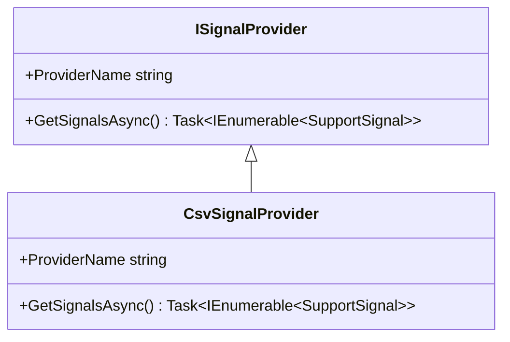
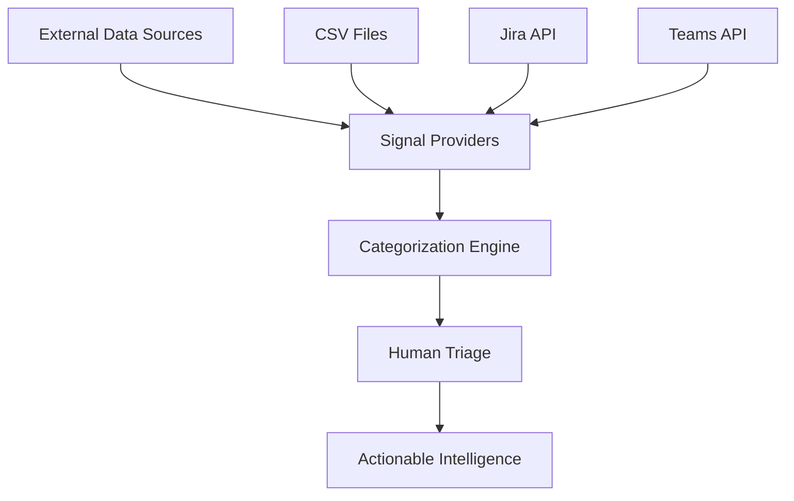

# SIREN Documentation & Diagrams Plan

## 🎯 **High Priority** (For Innovation Day Presentation)

### **1. System Architecture Diagram** ⭐ **CRITICAL**
**What**: High-level system overview showing plugin architecture
**Why**: Shows enterprise-grade thinking and extensibility
**Content**:
```
[External Sources] → [ISignalProvider] → [CategoryEngine] → [Dashboard]
     ↓                     ↓                    ↓             ↓
   - CSV Files          - Pluggable        - Keyword      - Triage View
   - Jira API           - Testable         - Matching     - Analytics
   - Teams API          - Configurable     - Priority     - Reports
   - Future Sources                        - Rules
```

### **2. Class Diagram (UML)** ⭐ **HIGH VALUE**
**What**: Shows relationships between interfaces, classes, and models
**Why**: Demonstrates OOP design and dependency patterns
**Content**:
- `ISignalProvider` → `CsvSignalProvider`, `JiraProvider` (future)
- `ICategorizer` → `CategoryEngine`
- `SupportSignal` model structure
- Dependency injection relationships

### **3. Data Flow Diagram** ⭐ **PRESENTATION GOLD**
**What**: Shows how support signals flow through the system
**Why**: Perfect for explaining the process to non-technical judges
**Content**:
```
Raw Signals → Processing → Categorization → Human Triage → Actionable Intelligence
```

### **4. Sequence Diagram** ⭐ **TECHNICAL DEPTH**
**What**: Shows the step-by-step process of signal processing
**Why**: Demonstrates understanding of async patterns and workflow
**Content**:
- User triggers processing
- Provider fetches signals
- CategoryEngine processes each signal
- Results displayed/stored

## 📊 **Medium Priority** (Professional Polish)

### **5. API Documentation**
**What**: Document all interfaces and public methods
**Why**: Shows API-first thinking and extensibility planning

### **6. Plugin Architecture Guide**
**What**: How to add new providers (Teams, Slack, etc.)
**Why**: Demonstrates forward-thinking and maintainability

### **7. Test Coverage Report**
**What**: Visual representation of your 17 passing tests
**Why**: Shows quality engineering practices

## 🚀 **Innovation Day Specific**

### **8. "Before vs After" Diagram**
**What**: Manual process vs. SIREN automated process
**Why**: Perfect for business case presentation

### **9. Human+AI Collaboration Workflow**
**What**: Shows where AI handles heavy lifting vs. human decisions
**Why**: Directly addresses innovation day theme

### **10. ROI Calculation Document**
**What**: Time savings, efficiency gains, cost reduction
**Why**: Business justification for continued investment

## 📋 **Quick Wins** (Can Create Tonight)

### **Immediate Value Documentation:**
1. **Interface Documentation** (30 min) - Already have good comments
2. **Architecture Overview** (45 min) - Document your design decisions
3. **Getting Started Guide** (30 min) - How to run and extend
4. **Test Strategy** (15 min) - Document your TDD approach

## 🎨 **Diagram Creation Tools**

### **Simple & Fast:**
- **Draw.io** (free, web-based) - Great for architecture diagrams
- **Mermaid** (markdown-based) - Can embed directly in GitHub
- **PlantUML** (code-to-diagram) - Perfect for class diagrams

### **For Class Diagrams:**


### **For Architecture Diagrams:**


## 📈 **Innovation Day Presentation Flow**

### **Recommended Diagram Sequence:**
1. **Problem Statement** (current manual process)
2. **Solution Architecture** (SIREN system overview)
3. **Data Flow** (how signals become intelligence)
4. **Human+AI Collaboration** (theme alignment)
5. **Technical Implementation** (class diagram + tests)
6. **Business Impact** (ROI and metrics)

## ✅ **Action Items for Tonight**

**Priority 1** (60 minutes):
- [x] Create system architecture diagram
- [x] Document interface design decisions  
- [x] Create simple data flow diagram
- [x] **BONUS: Dashboard UI development context created**

**Priority 2** (If time allows):
- [x] Generate class diagram from existing code
- [x] Document test strategy and coverage
- [x] Create "before vs after" process diagram
- [x] **BONUS: Complete technical implementation guide**

**Tomorrow Morning** (30 minutes):
- [ ] Polish diagrams for presentation
- [ ] Create business impact summary
- [ ] Prepare diagram exports for slides

## 🚀 **DASHBOARD UI READY**
- [x] **`DASHBOARD_UI_CONTEXT.md`** - Complete development context for Dashboard UI
- [x] **Integration points** documented with existing services
- [x] **UI/UX requirements** defined with user personas
- [x] **Technical approach** recommended (ASP.NET Core MVC)
- [x] **Manual triage feature** designed (innovation day highlight)
